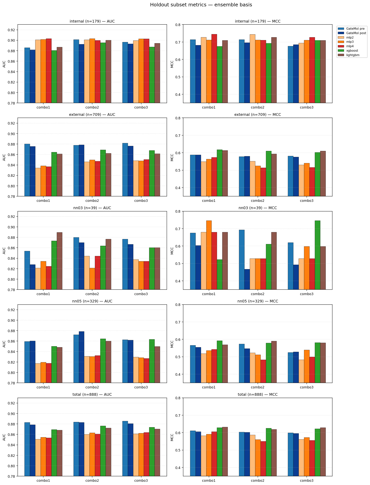
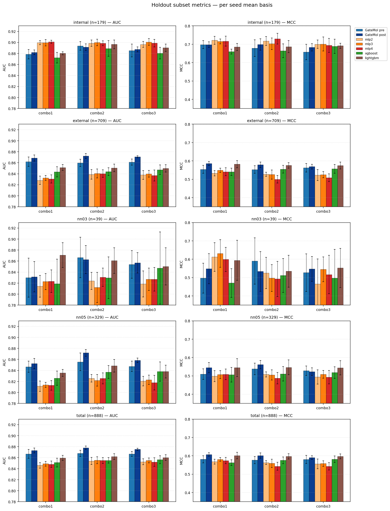
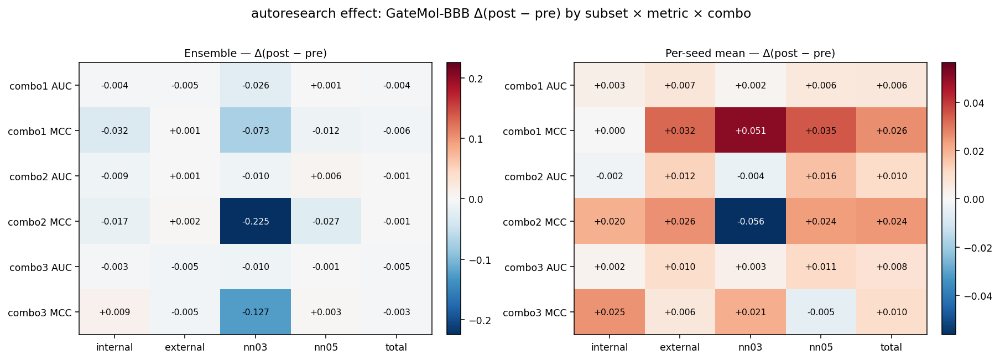
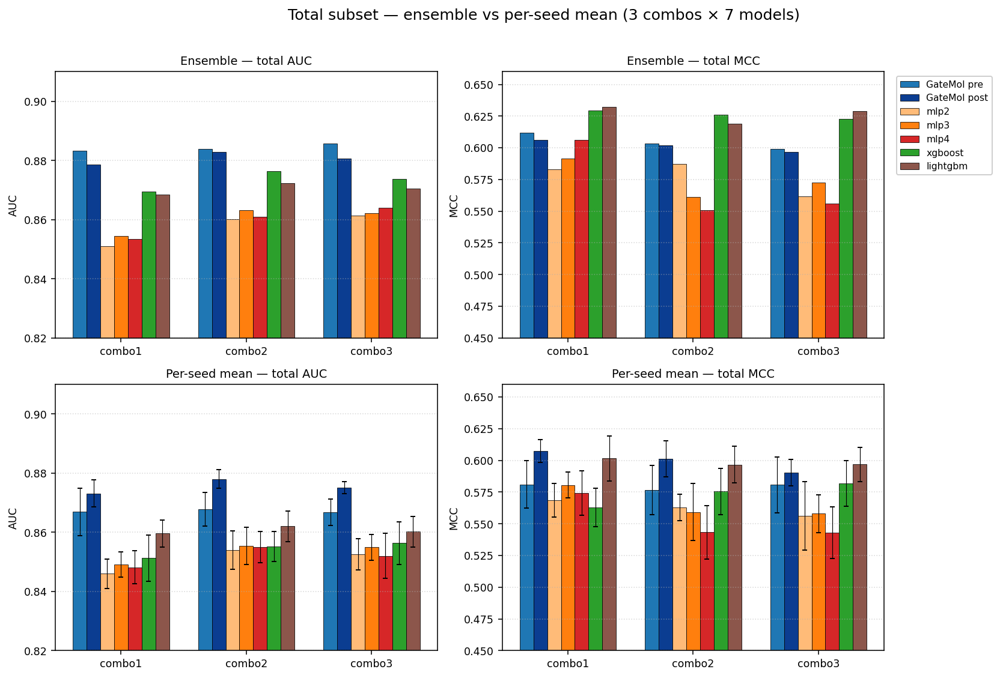

# GateMol-BBB pre vs post (autoresearch) vs baselines — holdout subset 비교

**작성일**: 2026-05-18  
**대상**: `autoresearch_combos_v2` 의 3개 combo (combo1/2/3) × 5개 holdout subset × 2개 집계 방식  
**비교군**: GateMol pre (iter1, autoresearch 전) / GateMol post (마지막 keep iter, autoresearch 후) / baseline 5종 (mlp2/3/4, xgboost, lightgbm)  
**학습 데이터·split**: 모두 `autoresearch_combos_v2` 동일 셋업 (merged pool, scaffold 80/20, 10 seed)

---

## 1. GateMol pre / post 정의

두 컬럼 모두 **GateMol-BBB 동일 코드베이스**의 서로 다른 시점입니다.

### 1.1 GateMol pre = autoresearch 적용 **전** 시작점 (iter1 `baseline reproduction`)

| Combo | iter | commit | val_AUC | val_MCC | note |
|---|---|---|---|---|---|
| combo1 | iter1 | d82eae5332 | 0.8443 | 0.5330 | baseline reproduction |
| combo2 | iter1 | 10e7b427ca | 0.8454 | 0.5181 | baseline reproduction |
| combo3 | iter1 | 39cc30d0eb | 0.8464 | 0.5152 | baseline reproduction |

### 1.2 GateMol post = autoresearch 적용 **후** 최종 상태 (마지막 keep=True iter)

| Combo | iter (holdout 평가용) | commit | val_AUC | val_MCC | note |
|---|---|---|---|---|---|
| combo1 | iter38 | 17578e2325 | 0.8520 | 0.5399 | Adam(wd=1e-5) -> AdamW(wd=0.01) inside train_model |
| combo2 | iter60 | e8411380cd | 0.8496 | 0.5360 | quad-pool gated+mean+max+attention |
| combo3 | iter54 | 9c72e703ec | 0.8526 | 0.5377 | patience=15 |

**combo1 주의**: 실제 마지막 keep은 **iter53** (`shadow patience 10→15`, commit 007e7ede57) 이지만 `final_holdout_eval.py` 의무화 정책 (commit fbbcc41) 이전에 keep된 iter라 holdout_eval 파일이 없음. iter53의 val 지표(val_AUC=0.8520, val_MCC=0.5399)가 iter38과 **완전히 동일**하므로 iter38의 holdout 결과로 iter53 상태를 대표하게 함.

### 1.3 pre → post 사이 누적 적용된 keep iter

```
combo1: iter1 → 6, 12, 17, 20, 22, 27, 29, 30, 32, 38, (53)
combo2: iter1 → 7, 10, 17, 20, 22, 24, 33, 50, 58, 60
combo3: iter1 → 7, 8, 9, 12, 13, 20, 29, 30, 34, 43, 54
```

주요 변경: modality dropout, multi-head SGU, EMA weights/warmup, AdamW 전환, cross-modal FiLM/attention pool, grad-clip, quad-pool, patience 조정 등.

### 1.4 val 지표 변화 (참고)

| Combo | val_AUC pre → post | val_MCC pre → post |
|---|---|---|
| combo1 | 0.8443 → 0.8520 (+0.0077) | 0.5330 → 0.5399 (+0.0069) |
| combo2 | 0.8454 → 0.8496 (+0.0042) | 0.5181 → 0.5360 (+0.0179) |
| combo3 | 0.8464 → 0.8526 (+0.0062) | 0.5152 → 0.5377 (+0.0225) |

---

## 2. 5개 holdout subset 비교표 (ensemble · per-seed mean)

- ★ = 해당 (combo × metric) 1위
- Δ = GateMol-BBB post − pre
- per-seed mean 셀은 `mean ± std` (std는 10 seed 표본분산, ddof=0)

### 2.1 `internal` subset (n=179)

#### internal — ensemble 기준

| Combo | metric | GateMol pre | GateMol post | mlp2 | mlp3 | mlp4 | xgb | lgbm | Δ |
|---|---|---|---|---|---|---|---|---|---|
| combo1 | AUC | 0.8858 | 0.8820 | 0.9012 | 0.9017 | **★0.9032** | 0.8806 | 0.8870 | -0.0038 |
| combo1 | MCC | 0.7140 | 0.6818 | 0.7274 | 0.7119 | **★0.7448** | 0.6757 | 0.7103 | -0.0323 |
| combo2 | AUC | 0.9015 | 0.8924 | 0.9010 | **★0.9034** | 0.8998 | 0.8955 | 0.9001 | -0.0091 |
| combo2 | MCC | 0.7140 | 0.6966 | **★0.7443** | 0.7119 | 0.7106 | 0.6932 | 0.7274 | -0.0175 |
| combo3 | AUC | 0.8965 | 0.8935 | 0.8995 | 0.9027 | **★0.9030** | 0.8875 | 0.8945 | -0.0031 |
| combo3 | MCC | 0.6761 | 0.6852 | 0.6945 | 0.7106 | **★0.7278** | 0.7103 | 0.7103 | +0.0091 |

#### internal — per-seed mean 기준

| Combo | metric | GateMol pre | GateMol post | mlp2 | mlp3 | mlp4 | xgb | lgbm | Δ |
|---|---|---|---|---|---|---|---|---|---|
| combo1 | AUC | 0.8787±0.0085 | 0.8820±0.0043 | 0.8997±0.0037 | 0.8994±0.0058 | **★0.9012±0.0028** | 0.8722±0.0095 | 0.8803±0.0027 | +0.0033 |
| combo1 | MCC | 0.6981±0.0212 | 0.6981±0.0154 | **★0.7215±0.0217** | 0.7153±0.0134 | 0.7166±0.0272 | 0.6600±0.0128 | 0.6849±0.0195 | +0.0000 |
| combo2 | AUC | 0.8937±0.0077 | 0.8915±0.0060 | 0.8986±0.0056 | **★0.8999±0.0058** | 0.8985±0.0043 | 0.8890±0.0143 | 0.8965±0.0079 | -0.0021 |
| combo2 | MCC | 0.6790±0.0451 | 0.6988±0.0313 | 0.7173±0.0242 | 0.7027±0.0316 | **★0.7300±0.0294** | 0.6645±0.0376 | 0.6870±0.0328 | +0.0198 |
| combo3 | AUC | 0.8853±0.0116 | 0.8874±0.0044 | 0.8963±0.0053 | **★0.9008±0.0059** | 0.8987±0.0069 | 0.8805±0.0104 | 0.8904±0.0066 | +0.0021 |
| combo3 | MCC | 0.6578±0.0424 | 0.6832±0.0204 | 0.7003±0.0225 | **★0.7013±0.0381** | 0.6938±0.0382 | 0.6887±0.0390 | 0.6916±0.0142 | +0.0255 |

### 2.2 `external` subset (n=709)

#### external — ensemble 기준

| Combo | metric | GateMol pre | GateMol post | mlp2 | mlp3 | mlp4 | xgb | lgbm | Δ |
|---|---|---|---|---|---|---|---|---|---|
| combo1 | AUC | **★0.8804** | 0.8754 | 0.8342 | 0.8385 | 0.8367 | 0.8646 | 0.8611 | -0.0050 |
| combo1 | MCC | 0.5879 | 0.5885 | 0.5491 | 0.5634 | 0.5741 | **★0.6182** | 0.6140 | +0.0006 |
| combo2 | AUC | 0.8777 | **★0.8786** | 0.8461 | 0.8498 | 0.8473 | 0.8690 | 0.8622 | +0.0010 |
| combo2 | MCC | 0.5779 | 0.5803 | 0.5515 | 0.5256 | 0.5136 | **★0.6107** | 0.5939 | +0.0023 |
| combo3 | AUC | **★0.8818** | 0.8765 | 0.8483 | 0.8481 | 0.8506 | 0.8678 | 0.8616 | -0.0053 |
| combo3 | MCC | 0.5811 | 0.5757 | 0.5306 | 0.5405 | 0.5158 | 0.6022 | **★0.6100** | -0.0054 |

#### external — per-seed mean 기준

| Combo | metric | GateMol pre | GateMol post | mlp2 | mlp3 | mlp4 | xgb | lgbm | Δ |
|---|---|---|---|---|---|---|---|---|---|
| combo1 | AUC | 0.8620±0.0086 | **★0.8686±0.0055** | 0.8282±0.0074 | 0.8323±0.0044 | 0.8307±0.0075 | 0.8435±0.0093 | 0.8514±0.0053 | +0.0066 |
| combo1 | MCC | 0.5540±0.0217 | **★0.5864±0.0111** | 0.5327±0.0146 | 0.5491±0.0118 | 0.5411±0.0215 | 0.5405±0.0195 | 0.5821±0.0190 | +0.0323 |
| combo2 | AUC | 0.8598±0.0067 | **★0.8722±0.0043** | 0.8389±0.0086 | 0.8405±0.0081 | 0.8403±0.0068 | 0.8439±0.0070 | 0.8507±0.0070 | +0.0125 |
| combo2 | MCC | 0.5532±0.0203 | **★0.5788±0.0150** | 0.5276±0.0109 | 0.5259±0.0246 | 0.5001±0.0205 | 0.5553±0.0209 | 0.5758±0.0148 | +0.0256 |
| combo3 | AUC | 0.8611±0.0056 | **★0.8709±0.0018** | 0.8379±0.0079 | 0.8400±0.0060 | 0.8369±0.0101 | 0.8473±0.0087 | 0.8497±0.0067 | +0.0098 |
| combo3 | MCC | 0.5625±0.0230 | 0.5689±0.0129 | 0.5228±0.0299 | 0.5249±0.0163 | 0.5082±0.0211 | 0.5568±0.0239 | **★0.5748±0.0189** | +0.0064 |

### 2.3 `nn03` subset (n=39)

#### nn03 — ensemble 기준

| Combo | metric | GateMol pre | GateMol post | mlp2 | mlp3 | mlp4 | xgb | lgbm | Δ |
|---|---|---|---|---|---|---|---|---|---|
| combo1 | AUC | 0.8539 | 0.8279 | 0.8214 | 0.8344 | 0.8247 | 0.8734 | **★0.8896** | -0.0260 |
| combo1 | MCC | 0.6759 | 0.6034 | 0.6803 | **★0.7462** | 0.6803 | 0.5224 | 0.6803 | -0.0725 |
| combo2 | AUC | **★0.8799** | 0.8701 | 0.8442 | 0.8214 | 0.8442 | 0.8636 | 0.8766 | -0.0097 |
| combo2 | MCC | **★0.6933** | 0.4681 | 0.5283 | 0.5283 | 0.5283 | 0.6118 | 0.6803 | -0.2251 |
| combo3 | AUC | **★0.8766** | 0.8669 | 0.8377 | 0.8344 | 0.8344 | 0.8604 | 0.8604 | -0.0097 |
| combo3 | MCC | 0.6201 | 0.4935 | 0.5283 | 0.5977 | 0.5283 | **★0.7462** | 0.5977 | -0.1266 |

#### nn03 — per-seed mean 기준

| Combo | metric | GateMol pre | GateMol post | mlp2 | mlp3 | mlp4 | xgb | lgbm | Δ |
|---|---|---|---|---|---|---|---|---|---|
| combo1 | AUC | 0.8299±0.0353 | 0.8315±0.0275 | 0.8143±0.0197 | 0.8227±0.0145 | 0.8234±0.0204 | 0.8188±0.0446 | **★0.8708±0.0225** | +0.0016 |
| combo1 | MCC | 0.4970±0.0809 | 0.5479±0.0819 | 0.6122±0.0778 | **★0.6314±0.0755** | 0.5989±0.0657 | 0.4708±0.0781 | 0.5939±0.1089 | +0.0509 |
| combo2 | AUC | **★0.8666±0.0367** | 0.8627±0.0254 | 0.8240±0.0156 | 0.8120±0.0275 | 0.8305±0.0166 | 0.8295±0.0378 | 0.8610±0.0232 | -0.0039 |
| combo2 | MCC | **★0.5901±0.1260** | 0.5337±0.1079 | 0.5249±0.0850 | 0.4975±0.0727 | 0.4925±0.0956 | 0.5113±0.0920 | 0.5347±0.0868 | -0.0564 |
| combo3 | AUC | 0.8539±0.0249 | **★0.8568±0.0183** | 0.8185±0.0236 | 0.8269±0.0202 | 0.8269±0.0213 | 0.8474±0.0656 | 0.8503±0.0337 | +0.0029 |
| combo3 | MCC | 0.5268±0.1020 | 0.5474±0.0673 | 0.4658±0.1359 | 0.5452±0.0678 | 0.5164±0.1046 | 0.4980±0.1549 | **★0.5524±0.1065** | +0.0206 |

### 2.4 `nn05` subset (n=329)

#### nn05 — ensemble 기준

| Combo | metric | GateMol pre | GateMol post | mlp2 | mlp3 | mlp4 | xgb | lgbm | Δ |
|---|---|---|---|---|---|---|---|---|---|
| combo1 | AUC | 0.8595 | **★0.8607** | 0.8173 | 0.8197 | 0.8179 | 0.8503 | 0.8484 | +0.0012 |
| combo1 | MCC | 0.5666 | 0.5546 | 0.5185 | 0.5366 | 0.5425 | **★0.5928** | 0.5696 | -0.0120 |
| combo2 | AUC | 0.8723 | **★0.8785** | 0.8309 | 0.8305 | 0.8324 | 0.8648 | 0.8602 | +0.0062 |
| combo2 | MCC | 0.5741 | 0.5471 | 0.5234 | 0.5115 | 0.4836 | 0.5789 | **★0.5909** | -0.0270 |
| combo3 | AUC | 0.8628 | 0.8619 | 0.8294 | 0.8285 | 0.8270 | **★0.8636** | 0.8499 | -0.0009 |
| combo3 | MCC | 0.5254 | 0.5281 | 0.4836 | 0.5399 | 0.4995 | **★0.5812** | 0.5801 | +0.0027 |

#### nn05 — per-seed mean 기준

| Combo | metric | GateMol pre | GateMol post | mlp2 | mlp3 | mlp4 | xgb | lgbm | Δ |
|---|---|---|---|---|---|---|---|---|---|
| combo1 | AUC | 0.8465±0.0101 | **★0.8524±0.0092** | 0.8114±0.0094 | 0.8137±0.0046 | 0.8128±0.0088 | 0.8258±0.0128 | 0.8355±0.0064 | +0.0059 |
| combo1 | MCC | 0.5095±0.0289 | 0.5446±0.0277 | 0.4986±0.0297 | 0.5070±0.0217 | 0.5088±0.0287 | 0.5063±0.0396 | **★0.5451±0.0490** | +0.0352 |
| combo2 | AUC | 0.8554±0.0160 | **★0.8718±0.0060** | 0.8256±0.0069 | 0.8220±0.0106 | 0.8254±0.0100 | 0.8371±0.0115 | 0.8484±0.0115 | +0.0164 |
| combo2 | MCC | 0.5379±0.0316 | **★0.5614±0.0226** | 0.5082±0.0141 | 0.5055±0.0278 | 0.4876±0.0308 | 0.5110±0.0392 | 0.5466±0.0407 | +0.0235 |
| combo3 | AUC | 0.8474±0.0093 | **★0.8583±0.0042** | 0.8205±0.0087 | 0.8229±0.0084 | 0.8177±0.0133 | 0.8378±0.0174 | 0.8378±0.0118 | +0.0109 |
| combo3 | MCC | 0.5281±0.0256 | 0.5226±0.0208 | 0.4944±0.0384 | 0.5085±0.0208 | 0.4931±0.0362 | 0.5181±0.0319 | **★0.5441±0.0386** | -0.0055 |

### 2.5 `total` subset (n=888)

#### total — ensemble 기준

| Combo | metric | GateMol pre | GateMol post | mlp2 | mlp3 | mlp4 | xgb | lgbm | Δ |
|---|---|---|---|---|---|---|---|---|---|
| combo1 | AUC | **★0.8832** | 0.8787 | 0.8511 | 0.8545 | 0.8535 | 0.8695 | 0.8684 | -0.0045 |
| combo1 | MCC | 0.6118 | 0.6062 | 0.5830 | 0.5916 | 0.6063 | 0.6292 | **★0.6322** | -0.0056 |
| combo2 | AUC | **★0.8839** | 0.8829 | 0.8601 | 0.8631 | 0.8609 | 0.8764 | 0.8723 | -0.0009 |
| combo2 | MCC | 0.6036 | 0.6022 | 0.5875 | 0.5610 | 0.5508 | **★0.6260** | 0.6192 | -0.0014 |
| combo3 | AUC | **★0.8857** | 0.8807 | 0.8614 | 0.8622 | 0.8639 | 0.8738 | 0.8706 | -0.0050 |
| combo3 | MCC | 0.5991 | 0.5965 | 0.5615 | 0.5726 | 0.5561 | 0.6226 | **★0.6290** | -0.0026 |

#### total — per-seed mean 기준

| Combo | metric | GateMol pre | GateMol post | mlp2 | mlp3 | mlp4 | xgb | lgbm | Δ |
|---|---|---|---|---|---|---|---|---|---|
| combo1 | AUC | 0.8670±0.0080 | **★0.8731±0.0045** | 0.8460±0.0050 | 0.8491±0.0042 | 0.8482±0.0056 | 0.8512±0.0079 | 0.8596±0.0045 | +0.0062 |
| combo1 | MCC | 0.5811±0.0189 | **★0.6074±0.0091** | 0.5686±0.0134 | 0.5806±0.0103 | 0.5744±0.0176 | 0.5630±0.0153 | 0.6015±0.0176 | +0.0262 |
| combo2 | AUC | 0.8678±0.0057 | **★0.8780±0.0032** | 0.8540±0.0065 | 0.8553±0.0063 | 0.8549±0.0053 | 0.8552±0.0051 | 0.8620±0.0052 | +0.0102 |
| combo2 | MCC | 0.5768±0.0194 | **★0.6013±0.0141** | 0.5631±0.0104 | 0.5593±0.0225 | 0.5434±0.0212 | 0.5756±0.0182 | 0.5968±0.0143 | +0.0245 |
| combo3 | AUC | 0.8668±0.0044 | **★0.8751±0.0020** | 0.8526±0.0052 | 0.8549±0.0044 | 0.8520±0.0076 | 0.8563±0.0073 | 0.8602±0.0052 | +0.0083 |
| combo3 | MCC | 0.5808±0.0219 | 0.5906±0.0104 | 0.5563±0.0270 | 0.5580±0.0148 | 0.5430±0.0204 | 0.5819±0.0178 | **★0.5969±0.0135** | +0.0098 |

---

## 3. 종합 패턴 요약

| Subset | ensemble: 누가 강한가 | per-seed mean: 누가 강한가 | autoresearch 효과 (Δ post-pre) |
|---|---|---|---|
| internal | mlp 계열 AUC/MCC 1위 (모든 combo) | mlp 계열 AUC/MCC 1위 | ensemble 약간 후퇴 / per-seed 약간 향상 |
| **external** | GateMol AUC, xgb/lgbm MCC | **GateMol AUC/MCC 거의 1위** | **per-seed 모든 항목 명확 향상** |
| nn03 (n=39) | lgbm AUC, 변동 매우 큼 | GateMol AUC (combo2/3), lgbm (combo1) | 작은 표본 → ensemble 임계값 민감, 큰 변동 |
| nn05 | GateMol AUC, xgb/lgbm MCC | GateMol AUC, lgbm/GateMol MCC | 일관된 향상 |
| **total** | pre가 ensemble AUC 최고, lgbm/xgb MCC | **GateMol post AUC/MCC 거의 1위** | **per-seed 명확 향상 / ensemble 미세 후퇴** |

### 결정적 패턴

- **ensemble vs per-seed 의 결론 정반대**: GateMol-BBB의 seed 다양성이 작아 ensemble bonus가 거의 0 — 반면 tree 계열은 ensemble bonus가 큼 (xgb 평균 +0.05 on total MCC).
- **autoresearch의 성격**: 개별 모델 품질(per-seed mean)은 모든 subset/지표에서 향상, 그러나 ensemble bonus를 줄이는 부작용 → ensemble holdout 지표는 미세 후퇴.
- **운영 metric 선택의 중요성**: 단일 모델 운영이면 autoresearch가 성공, 10-seed soft-vote 운영이면 효과가 희석됨.

---

## 4. 시각화



*Figure 1: Ensemble (soft-voting) 기준 — 5 subsets × 2 metrics. 3 combo 묶음, 7 모델 비교.*



*Figure 2: Per-seed mean (±std error bar) 기준 — 동일 레이아웃.*



*Figure 3: autoresearch가 GateMol-BBB의 subset별 metric에 미친 변화량 heatmap. 빨강 = 후퇴, 파랑 = 향상.*



*Figure 4: total subset 집중 비교 — 같은 데이터를 두 집계 방식으로 그리면 결론이 달라지는 지점이 보임.*

---

## 5. 데이터 출처

- GateMol pre/post: `combos-v2-combo{1,2,3}/results/<combo_str>/holdout_eval/iter<N>_*.json`
- baselines: `autoresearch_combos_v2/results/<combo_str>/baselines/{mlp2,mlp3,mlp4,xgboost,lightgbm}.json`
- 베이스라인 학습/평가 스크립트: `autoresearch_combos_v2/baselines/run_baselines.py` (이미 2026-05-17 실행)
- 학습 데이터: `/home/minji/feature_cache_merged/pool.npz` (internal_remaining + external_remaining, 9786개, scaffold 80/20)
- holdout subset: `/home/minji/holdout_subset/merged_holdout_10pct_seed42_simfilter09_{internal,external,nn03,nn05,total}/`
