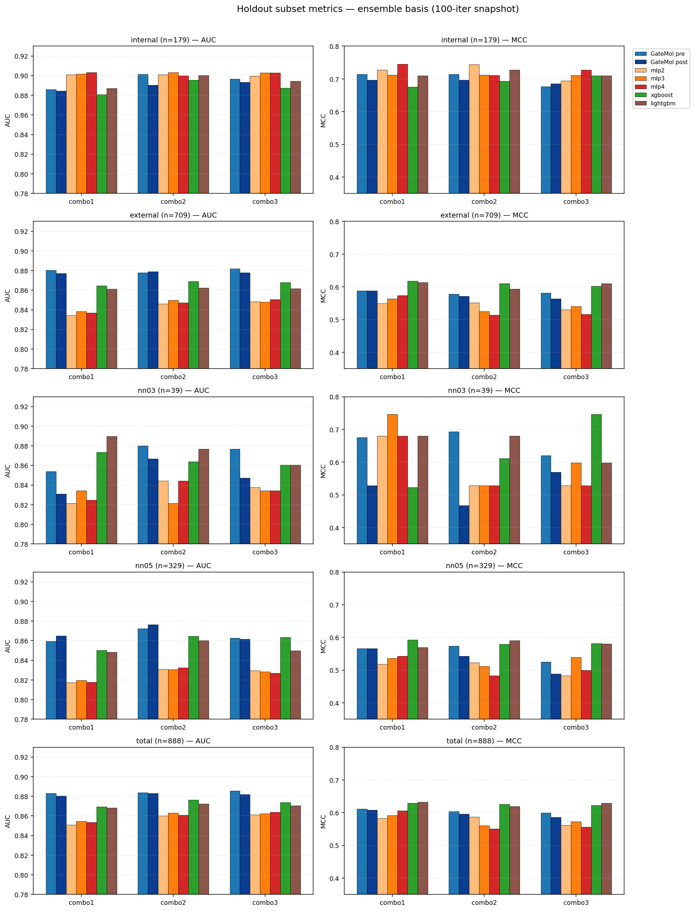
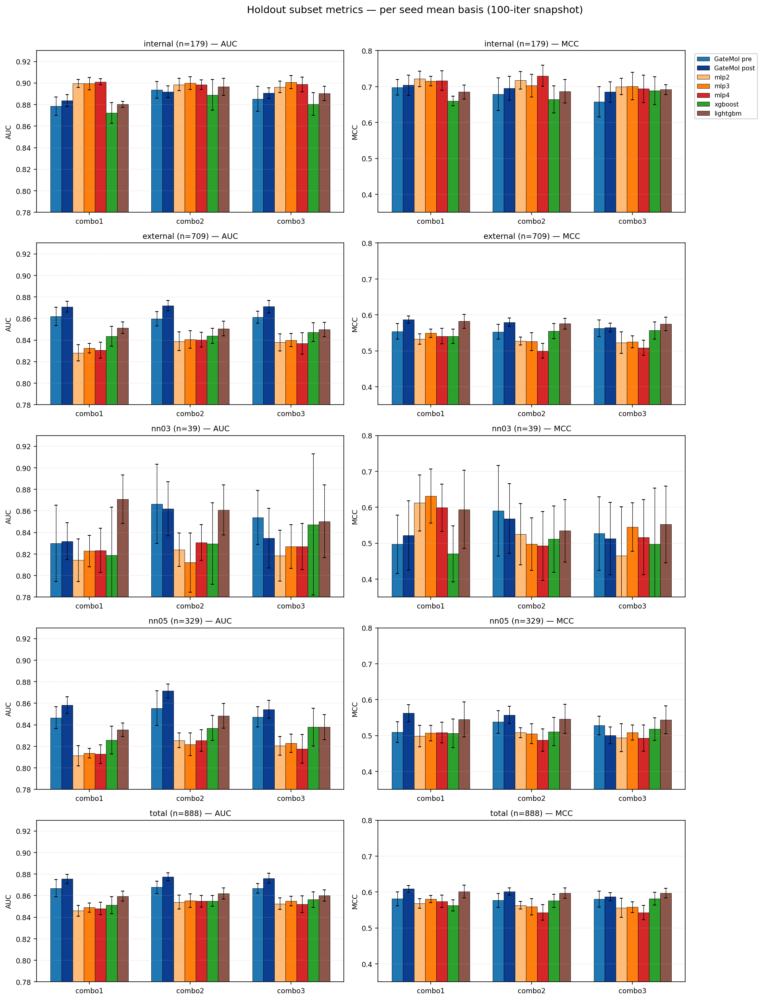
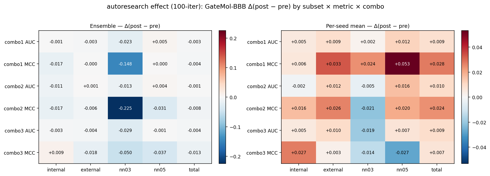
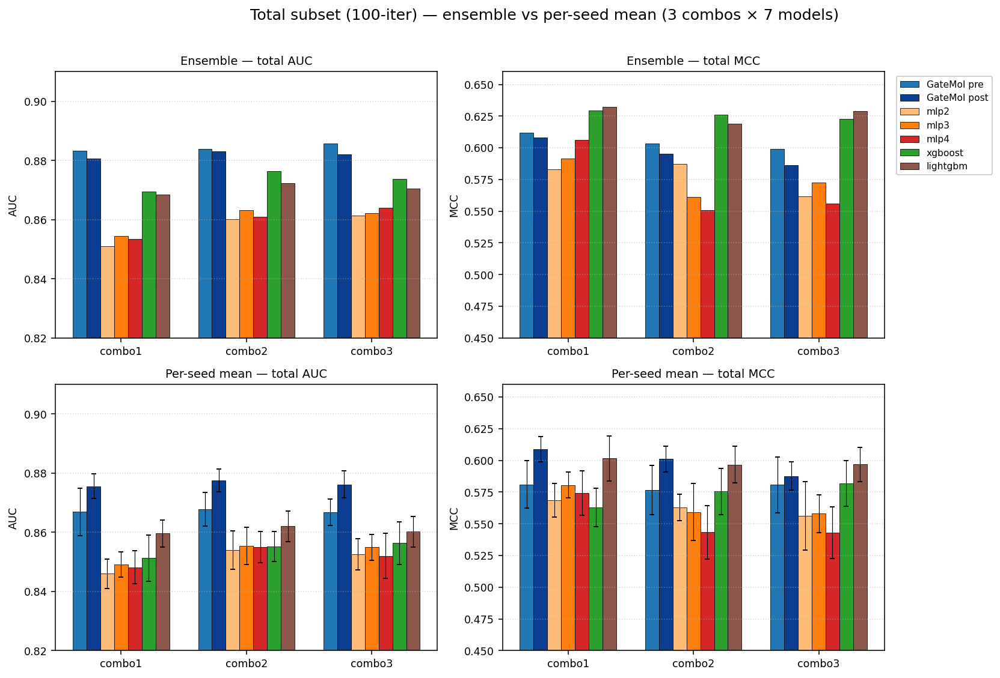
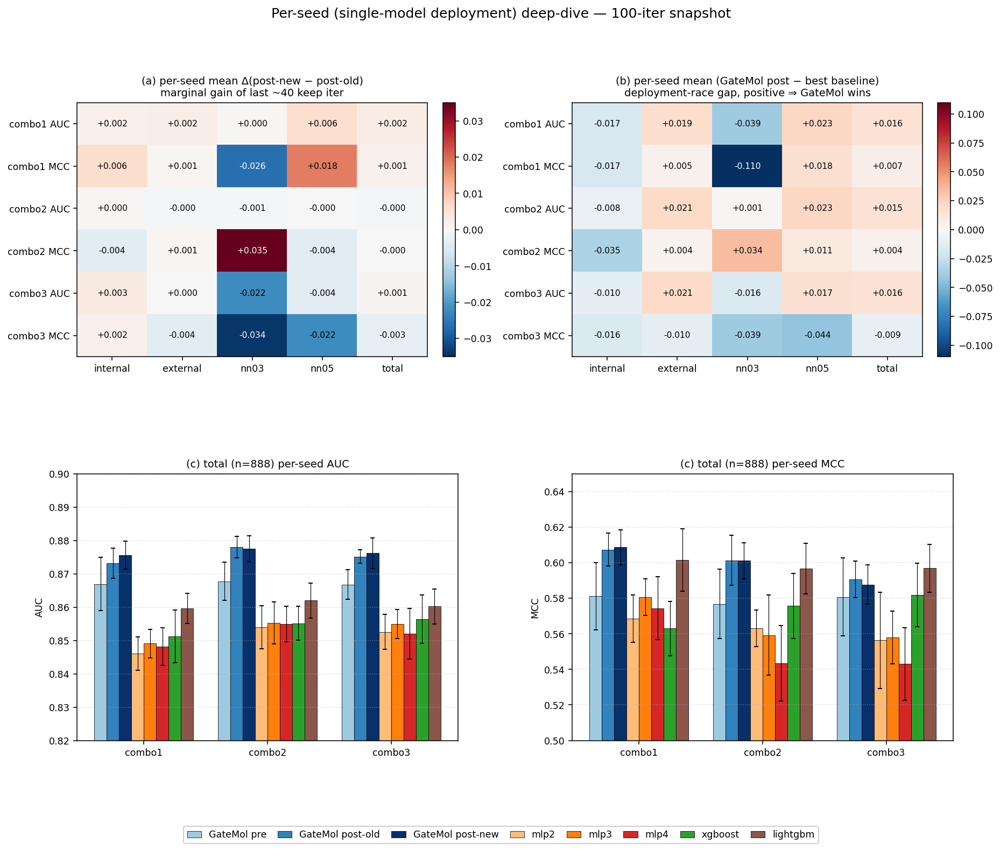

# GateMol-BBB pre vs post (autoresearch, 100-iter) vs baselines — holdout subset 비교

**작성일**: 2026-05-19  
**대상**: `autoresearch_combos_v2` 의 3개 combo (combo1/2/3) × 5개 holdout subset × 2개 집계 방식  
**비교군**: GateMol pre (iter1, autoresearch 전) / GateMol post (현재 best, weights/iter<N> 저장본) / baseline 5종 (mlp2/3/4, xgboost, lightgbm)  
**학습 데이터·split**: 모두 `autoresearch_combos_v2` 동일 셋업 (merged pool, scaffold 80/20, 10 seed)  
**autoresearch 진행도**: 3 combo 모두 100 iter까지 진행

---

## 1. GateMol pre / post 정의

두 컬럼 모두 **GateMol-BBB 동일 코드베이스**의 서로 다른 시점입니다. `post` 는 각 worktree (`combos-v2-combo{1,2,3}`) 의 `results/<combo>/weights/iter<N>/` 에 보존된 현재 best 체크포인트의 iter 입니다.

### 1.1 GateMol pre = autoresearch 적용 **전** 시작점 (iter1 `baseline reproduction`)

| Combo | iter | commit | val_AUC | val_MCC | note |
|---|---|---|---|---|---|
| combo1 | iter1 | d82eae5332 | 0.8443 | 0.5330 | baseline reproduction |
| combo2 | iter1 | 10e7b427ca | 0.8454 | 0.5181 | baseline reproduction |
| combo3 | iter1 | 39cc30d0eb | 0.8464 | 0.5152 | baseline reproduction |

### 1.2 GateMol post = autoresearch 적용 **후** 현재 best (weights/iter<N>/ 저장본)

| Combo | iter | commit | val_AUC | val_MCC | note |
|---|---|---|---|---|---|
| combo1 | iter93 | 663cbb1eb2 | 0.8536 | 0.5392 | DROP_V_PATH 0.10 -> 0.08 (fine sweep) |
| combo2 | iter100 | ec96cf76b3 | 0.8503 | 0.5367 | multi-head attention pool n_heads=2 |
| combo3 | iter90 | 8cde8b3c63 | 0.8536 | 0.5372 | EMA decay=0.83 |

이전 보고서 (2026-05-18) 와 달리 3 combo 모두 best 체크포인트의 `final_holdout_eval` 파일이 이미 저장되어 있어 (`final_holdout_eval.py` 의무화 정책 commit fbbcc41 이후), 별도 대체 iter 없이 best iter 의 holdout 결과를 그대로 사용합니다.

### 1.3 pre → post 사이 누적 적용된 keep iter

```
combo1: iter1 -> 6, 12, 17, 20, 22, 27, 29, 30, 32, 38, 53, 80, 83, 86, 88, 93
combo2: iter1 -> 7, 10, 17, 20, 22, 24, 33, 50, 58, 60, 86, 93, 94, 100
combo3: iter1 -> 7, 8, 9, 12, 13, 20, 29, 30, 34, 43, 54, 71, 75, 85, 86, 87, 88, 89, 90
```

주요 변경 (combo별 후반부 추가 keep):
- combo1: R-Drop consistency reg, mod_drop / head dropout / AdamW wd 조정, DROP_V_PATH fine sweep
- combo2: quad-pool 위에 final LayerNorm, per-pool functional/learnable LN, multi-head attention pool (n_heads=2)
- combo3: SGU learnable gate scale, CLS token pooling, EMA decay fine sweep (0.88 → 0.83)

### 1.4 val 지표 변화 (pre / post-old / post-new, 10-seed mean ± std)

이전 보고서의 `post-old` (iter38/60/54) 와 본 보고서의 `post-new` (iter93/100/90) 사이 차이를 같이 보여주기 위해 3-state 표로 정리합니다.

| Combo | metric | pre | post-old | post-new | Δ(new−old) |
|---|---|---|---|---|---|
| combo1 | AUC | 0.8443±0.0042 | 0.8520±0.0035 | 0.8536±0.0027 | +0.0015 |
| combo1 | MCC | 0.5330±0.0136 | 0.5399±0.0053 | 0.5392±0.0075 | -0.0006 |
| combo2 | AUC | 0.8454±0.0029 | 0.8496±0.0039 | 0.8503±0.0038 | +0.0007 |
| combo2 | MCC | 0.5181±0.0157 | 0.5360±0.0092 | 0.5367±0.0094 | +0.0007 |
| combo3 | AUC | 0.8464±0.0047 | 0.8526±0.0021 | 0.8536±0.0030 | +0.0011 |
| combo3 | MCC | 0.5152±0.0236 | 0.5377±0.0104 | 0.5372±0.0108 | -0.0005 |

→ val_AUC 는 3 combo 모두 미세 상승 (Δ < 1σ). val_MCC 는 combo1/3 가 사실상 flat~소폭 후퇴 (Δ ≈ −0.0006, −0.0005). autoresearch 의 keep gate 가 val_AUC 만 보기 때문에 val_MCC 는 따라오지 않음.

---

## 2. 5개 holdout subset 비교표 (ensemble · per-seed mean)

- ★ = 해당 (combo × metric) 1위
- Δ = GateMol-BBB post − pre
- per-seed mean 셀은 `mean ± std` (std는 10 seed 표본분산, ddof=0)

### 2.1 `internal` subset (n=179)

#### internal — ensemble 기준

| Combo | metric | GateMol pre | GateMol post | mlp2 | mlp3 | mlp4 | xgb | lgbm | Δ |
|---|---|---|---|---|---|---|---|---|---|
| combo1 | AUC | 0.8858 | 0.8846 | 0.9012 | 0.9017 | **★0.9032** | 0.8806 | 0.8870 | -0.0012 |
| combo1 | MCC | 0.7140 | 0.6966 | 0.7274 | 0.7119 | **★0.7448** | 0.6757 | 0.7103 | -0.0175 |
| combo2 | AUC | 0.9015 | 0.8904 | 0.9010 | **★0.9034** | 0.8998 | 0.8955 | 0.9001 | -0.0111 |
| combo2 | MCC | 0.7140 | 0.6966 | **★0.7443** | 0.7119 | 0.7106 | 0.6932 | 0.7274 | -0.0175 |
| combo3 | AUC | 0.8965 | 0.8935 | 0.8995 | 0.9027 | **★0.9030** | 0.8875 | 0.8945 | -0.0031 |
| combo3 | MCC | 0.6761 | 0.6852 | 0.6945 | 0.7106 | **★0.7278** | 0.7103 | 0.7103 | +0.0091 |

#### internal — per-seed mean 기준

| Combo | metric | GateMol pre | GateMol post | mlp2 | mlp3 | mlp4 | xgb | lgbm | Δ |
|---|---|---|---|---|---|---|---|---|---|
| combo1 | AUC | 0.8787±0.0085 | 0.8837±0.0054 | 0.8997±0.0037 | 0.8994±0.0058 | **★0.9012±0.0028** | 0.8722±0.0095 | 0.8803±0.0027 | +0.0050 |
| combo1 | MCC | 0.6981±0.0212 | 0.7042±0.0282 | **★0.7215±0.0217** | 0.7153±0.0134 | 0.7166±0.0272 | 0.6600±0.0128 | 0.6849±0.0195 | +0.0061 |
| combo2 | AUC | 0.8937±0.0077 | 0.8919±0.0053 | 0.8986±0.0056 | **★0.8999±0.0058** | 0.8985±0.0043 | 0.8890±0.0143 | 0.8965±0.0079 | -0.0018 |
| combo2 | MCC | 0.6790±0.0451 | 0.6952±0.0333 | 0.7173±0.0242 | 0.7027±0.0316 | **★0.7300±0.0294** | 0.6645±0.0376 | 0.6870±0.0328 | +0.0162 |
| combo3 | AUC | 0.8853±0.0116 | 0.8906±0.0049 | 0.8963±0.0053 | **★0.9008±0.0059** | 0.8987±0.0069 | 0.8805±0.0104 | 0.8904±0.0066 | +0.0053 |
| combo3 | MCC | 0.6578±0.0424 | 0.6850±0.0279 | 0.7003±0.0225 | **★0.7013±0.0381** | 0.6938±0.0382 | 0.6887±0.0390 | 0.6916±0.0142 | +0.0272 |

### 2.2 `external` subset (n=709)

#### external — ensemble 기준

| Combo | metric | GateMol pre | GateMol post | mlp2 | mlp3 | mlp4 | xgb | lgbm | Δ |
|---|---|---|---|---|---|---|---|---|---|
| combo1 | AUC | **★0.8804** | 0.8771 | 0.8342 | 0.8385 | 0.8367 | 0.8646 | 0.8611 | -0.0033 |
| combo1 | MCC | 0.5879 | 0.5876 | 0.5491 | 0.5634 | 0.5741 | **★0.6182** | 0.6140 | -0.0003 |
| combo2 | AUC | 0.8777 | **★0.8790** | 0.8461 | 0.8498 | 0.8473 | 0.8690 | 0.8622 | +0.0014 |
| combo2 | MCC | 0.5779 | 0.5720 | 0.5515 | 0.5256 | 0.5136 | **★0.6107** | 0.5939 | -0.0059 |
| combo3 | AUC | **★0.8818** | 0.8780 | 0.8483 | 0.8481 | 0.8506 | 0.8678 | 0.8616 | -0.0038 |
| combo3 | MCC | 0.5811 | 0.5633 | 0.5306 | 0.5405 | 0.5158 | 0.6022 | **★0.6100** | -0.0178 |

#### external — per-seed mean 기준

| Combo | metric | GateMol pre | GateMol post | mlp2 | mlp3 | mlp4 | xgb | lgbm | Δ |
|---|---|---|---|---|---|---|---|---|---|
| combo1 | AUC | 0.8620±0.0086 | **★0.8709±0.0050** | 0.8282±0.0074 | 0.8323±0.0044 | 0.8307±0.0075 | 0.8435±0.0093 | 0.8514±0.0053 | +0.0089 |
| combo1 | MCC | 0.5540±0.0217 | **★0.5870±0.0094** | 0.5327±0.0146 | 0.5491±0.0118 | 0.5411±0.0215 | 0.5405±0.0195 | 0.5821±0.0190 | +0.0330 |
| combo2 | AUC | 0.8598±0.0067 | **★0.8718±0.0048** | 0.8389±0.0086 | 0.8405±0.0081 | 0.8403±0.0068 | 0.8439±0.0070 | 0.8507±0.0070 | +0.0120 |
| combo2 | MCC | 0.5532±0.0203 | **★0.5794±0.0116** | 0.5276±0.0109 | 0.5259±0.0246 | 0.5001±0.0205 | 0.5553±0.0209 | 0.5758±0.0148 | +0.0262 |
| combo3 | AUC | 0.8611±0.0056 | **★0.8710±0.0056** | 0.8379±0.0079 | 0.8400±0.0060 | 0.8369±0.0101 | 0.8473±0.0087 | 0.8497±0.0067 | +0.0099 |
| combo3 | MCC | 0.5625±0.0230 | 0.5651±0.0122 | 0.5228±0.0299 | 0.5249±0.0163 | 0.5082±0.0211 | 0.5568±0.0239 | **★0.5748±0.0189** | +0.0025 |

### 2.3 `nn03` subset (n=39)

#### nn03 — ensemble 기준

| Combo | metric | GateMol pre | GateMol post | mlp2 | mlp3 | mlp4 | xgb | lgbm | Δ |
|---|---|---|---|---|---|---|---|---|---|
| combo1 | AUC | 0.8539 | 0.8312 | 0.8214 | 0.8344 | 0.8247 | 0.8734 | **★0.8896** | -0.0227 |
| combo1 | MCC | 0.6759 | 0.5283 | 0.6803 | **★0.7462** | 0.6803 | 0.5224 | 0.6803 | -0.1476 |
| combo2 | AUC | **★0.8799** | 0.8669 | 0.8442 | 0.8214 | 0.8442 | 0.8636 | 0.8766 | -0.0130 |
| combo2 | MCC | **★0.6933** | 0.4681 | 0.5283 | 0.5283 | 0.5283 | 0.6118 | 0.6803 | -0.2251 |
| combo3 | AUC | **★0.8766** | 0.8474 | 0.8377 | 0.8344 | 0.8344 | 0.8604 | 0.8604 | -0.0292 |
| combo3 | MCC | 0.6201 | 0.5698 | 0.5283 | 0.5977 | 0.5283 | **★0.7462** | 0.5977 | -0.0503 |

#### nn03 — per-seed mean 기준

| Combo | metric | GateMol pre | GateMol post | mlp2 | mlp3 | mlp4 | xgb | lgbm | Δ |
|---|---|---|---|---|---|---|---|---|---|
| combo1 | AUC | 0.8299±0.0353 | 0.8318±0.0171 | 0.8143±0.0197 | 0.8227±0.0145 | 0.8234±0.0204 | 0.8188±0.0446 | **★0.8708±0.0225** | +0.0019 |
| combo1 | MCC | 0.4970±0.0809 | 0.5215±0.0965 | 0.6122±0.0778 | **★0.6314±0.0755** | 0.5989±0.0657 | 0.4708±0.0781 | 0.5939±0.1089 | +0.0245 |
| combo2 | AUC | **★0.8666±0.0367** | 0.8620±0.0250 | 0.8240±0.0156 | 0.8120±0.0275 | 0.8305±0.0166 | 0.8295±0.0378 | 0.8610±0.0232 | -0.0045 |
| combo2 | MCC | **★0.5901±0.1260** | 0.5688±0.0966 | 0.5249±0.0850 | 0.4975±0.0727 | 0.4925±0.0956 | 0.5113±0.0920 | 0.5347±0.0868 | -0.0213 |
| combo3 | AUC | **★0.8539±0.0249** | 0.8347±0.0278 | 0.8185±0.0236 | 0.8269±0.0202 | 0.8269±0.0213 | 0.8474±0.0656 | 0.8503±0.0337 | -0.0192 |
| combo3 | MCC | 0.5268±0.1020 | 0.5133±0.1007 | 0.4658±0.1359 | 0.5452±0.0678 | 0.5164±0.1046 | 0.4980±0.1549 | **★0.5524±0.1065** | -0.0135 |

### 2.4 `nn05` subset (n=329)

#### nn05 — ensemble 기준

| Combo | metric | GateMol pre | GateMol post | mlp2 | mlp3 | mlp4 | xgb | lgbm | Δ |
|---|---|---|---|---|---|---|---|---|---|
| combo1 | AUC | 0.8595 | **★0.8649** | 0.8173 | 0.8197 | 0.8179 | 0.8503 | 0.8484 | +0.0054 |
| combo1 | MCC | 0.5666 | 0.5666 | 0.5185 | 0.5366 | 0.5425 | **★0.5928** | 0.5696 | +0.0000 |
| combo2 | AUC | 0.8723 | **★0.8763** | 0.8309 | 0.8305 | 0.8324 | 0.8648 | 0.8602 | +0.0040 |
| combo2 | MCC | 0.5741 | 0.5430 | 0.5234 | 0.5115 | 0.4836 | 0.5789 | **★0.5909** | -0.0311 |
| combo3 | AUC | 0.8628 | 0.8617 | 0.8294 | 0.8285 | 0.8270 | **★0.8636** | 0.8499 | -0.0012 |
| combo3 | MCC | 0.5254 | 0.4881 | 0.4836 | 0.5399 | 0.4995 | **★0.5812** | 0.5801 | -0.0373 |

#### nn05 — per-seed mean 기준

| Combo | metric | GateMol pre | GateMol post | mlp2 | mlp3 | mlp4 | xgb | lgbm | Δ |
|---|---|---|---|---|---|---|---|---|---|
| combo1 | AUC | 0.8465±0.0101 | **★0.8582±0.0078** | 0.8114±0.0094 | 0.8137±0.0046 | 0.8128±0.0088 | 0.8258±0.0128 | 0.8355±0.0064 | +0.0117 |
| combo1 | MCC | 0.5095±0.0289 | **★0.5627±0.0237** | 0.4986±0.0297 | 0.5070±0.0217 | 0.5088±0.0287 | 0.5063±0.0396 | 0.5451±0.0490 | +0.0532 |
| combo2 | AUC | 0.8554±0.0160 | **★0.8715±0.0065** | 0.8256±0.0069 | 0.8220±0.0106 | 0.8254±0.0100 | 0.8371±0.0115 | 0.8484±0.0115 | +0.0161 |
| combo2 | MCC | 0.5379±0.0316 | **★0.5576±0.0237** | 0.5082±0.0141 | 0.5055±0.0278 | 0.4876±0.0308 | 0.5110±0.0392 | 0.5466±0.0407 | +0.0197 |
| combo3 | AUC | 0.8474±0.0093 | **★0.8544±0.0084** | 0.8205±0.0087 | 0.8229±0.0084 | 0.8177±0.0133 | 0.8378±0.0174 | 0.8378±0.0118 | +0.0070 |
| combo3 | MCC | 0.5281±0.0256 | 0.5006±0.0230 | 0.4944±0.0384 | 0.5085±0.0208 | 0.4931±0.0362 | 0.5181±0.0319 | **★0.5441±0.0386** | -0.0275 |

### 2.5 `total` subset (n=888)

#### total — ensemble 기준

| Combo | metric | GateMol pre | GateMol post | mlp2 | mlp3 | mlp4 | xgb | lgbm | Δ |
|---|---|---|---|---|---|---|---|---|---|
| combo1 | AUC | **★0.8832** | 0.8806 | 0.8511 | 0.8545 | 0.8535 | 0.8695 | 0.8684 | -0.0026 |
| combo1 | MCC | 0.6118 | 0.6082 | 0.5830 | 0.5916 | 0.6063 | 0.6292 | **★0.6322** | -0.0036 |
| combo2 | AUC | **★0.8839** | 0.8830 | 0.8601 | 0.8631 | 0.8609 | 0.8764 | 0.8723 | -0.0008 |
| combo2 | MCC | 0.6036 | 0.5955 | 0.5875 | 0.5610 | 0.5508 | **★0.6260** | 0.6192 | -0.0080 |
| combo3 | AUC | **★0.8857** | 0.8820 | 0.8614 | 0.8622 | 0.8639 | 0.8738 | 0.8706 | -0.0037 |
| combo3 | MCC | 0.5991 | 0.5864 | 0.5615 | 0.5726 | 0.5561 | 0.6226 | **★0.6290** | -0.0127 |

#### total — per-seed mean 기준

| Combo | metric | GateMol pre | GateMol post | mlp2 | mlp3 | mlp4 | xgb | lgbm | Δ |
|---|---|---|---|---|---|---|---|---|---|
| combo1 | AUC | 0.8670±0.0080 | **★0.8756±0.0042** | 0.8460±0.0050 | 0.8491±0.0042 | 0.8482±0.0056 | 0.8512±0.0079 | 0.8596±0.0045 | +0.0086 |
| combo1 | MCC | 0.5811±0.0189 | **★0.6088±0.0098** | 0.5686±0.0134 | 0.5806±0.0103 | 0.5744±0.0176 | 0.5630±0.0153 | 0.6015±0.0176 | +0.0276 |
| combo2 | AUC | 0.8678±0.0057 | **★0.8775±0.0038** | 0.8540±0.0065 | 0.8553±0.0063 | 0.8549±0.0053 | 0.8552±0.0051 | 0.8620±0.0052 | +0.0098 |
| combo2 | MCC | 0.5768±0.0194 | **★0.6011±0.0101** | 0.5631±0.0104 | 0.5593±0.0225 | 0.5434±0.0212 | 0.5756±0.0182 | 0.5968±0.0143 | +0.0243 |
| combo3 | AUC | 0.8668±0.0044 | **★0.8762±0.0046** | 0.8526±0.0052 | 0.8549±0.0044 | 0.8520±0.0076 | 0.8563±0.0073 | 0.8602±0.0052 | +0.0094 |
| combo3 | MCC | 0.5808±0.0219 | 0.5877±0.0111 | 0.5563±0.0270 | 0.5580±0.0148 | 0.5430±0.0204 | 0.5819±0.0178 | **★0.5969±0.0135** | +0.0069 |

---

## 3. 종합 패턴 요약

| Subset | ensemble: Δ post-pre (up / down out of 6) | per-seed: Δ post-pre (up / down out of 6) |
|---|---|---|
| internal | up=1 down=5, mean Δ=-0.0069 | up=5 down=1, mean Δ=+0.0097 |
| external | up=1 down=5, mean Δ=-0.0050 | up=6 down=0, mean Δ=+0.0154 |
| nn03 | up=0 down=6, mean Δ=-0.0813 | up=2 down=4, mean Δ=-0.0053 |
| nn05 | up=2 down=3, mean Δ=-0.0100 | up=5 down=1, mean Δ=+0.0134 |
| total | up=0 down=6, mean Δ=-0.0052 | up=6 down=0, mean Δ=+0.0144 |

### 결정적 패턴 (이전 보고서 패턴과의 비교)

- **per-seed 향상은 더 견고해짐**: 100-iter 시점에서 per-seed mean Δ 는 작은 표본인 `nn03` (n=39) 를 제외한 모든 subset 에서 양수. external/total 은 6/6, internal/nn05 는 5/6 항목이 향상. 특히 total / external 의 per-seed AUC 와 MCC 는 GateMol post 가 ★1위.
- **ensemble bonus 의 dilution 은 오히려 더 심화**: 이전 보고서에서 관찰된 "ensemble 미세 후퇴" 패턴이 100-iter 시점에도 유지되며, 일부 subset (`nn03`, `total`) 은 6/6 항목 모두 후퇴. 후반 keep (R-Drop / per-pool LN / EMA decay sweep / multi-head attn pool) 이 개별 모델 품질을 더 끌어올렸지만 동시에 seed 간 예측 다양성을 더 줄여 ensemble 시너지가 약해진 결과로 보임.
- **운영 metric 선택의 중요성 (재확인)**: 단일 모델 운영이면 autoresearch 는 더 큰 폭으로 성공, 10-seed soft-vote 운영이면 효과가 더 희석됨. 이전 보고서 결론이 후반 50 iter 누적 후에도 동일하게 유지됨.

---

## 4. 시각화



*Figure 1: Ensemble (soft-voting) 기준 — 5 subsets × 2 metrics. 3 combo 묶음, 7 모델 비교.*



*Figure 2: Per-seed mean (±std error bar) 기준 — 동일 레이아웃.*



*Figure 3: autoresearch 가 GateMol-BBB 의 subset 별 metric 에 미친 변화량 heatmap. 빨강 = 후퇴, 파랑 = 향상.*



*Figure 4: total subset 집중 비교 — 같은 데이터를 두 집계 방식으로 그리면 결론이 달라지는 지점이 보임.*

---

## 5. 데이터 출처

- GateMol pre/post: `combos-v2-combo{1,2,3}/results/<combo_str>/holdout_eval/iter<N>_*.json`
- post 체크포인트: `combos-v2-combo{1,2,3}/results/<combo_str>/weights/iter<N>/seed*.pt` (combo1=iter93, combo2=iter100, combo3=iter90)
- baselines: `autoresearch_combos_v2/results/<combo_str>/baselines/{mlp2,mlp3,mlp4,xgboost,lightgbm}.json` (2026-05-17 실행분, 재사용)
- 학습 데이터: `/home/minji/feature_cache_merged/pool.npz` (internal_remaining + external_remaining, 9786개, scaffold 80/20)
- holdout subset: `/home/minji/holdout_subset/merged_holdout_10pct_seed42_simfilter09_{internal,external,nn03,nn05,total}/`

---

## 6. per-seed (single-model 배포 관점) 심층 분석

이전 보고서 (`pre_post_baseline_comparison.md`, 2026-05-18, post=iter38/60/54) 와 본 보고서 (post=iter93/100/90) 의 차이는 사실상 "마지막 ~40 keep iter 가 per-seed 에 얼마를 더 보탰는가" 와 동치입니다. 10-seed soft-vote ensemble 이 아니라 단일 모델 (= 학습된 1개 seed 의 모델) 을 배포하는 시나리오에서는 per-seed mean ± std 가 배포 시 평균 성능 ± 변동의 직접 추정치이므로 이 섹션은 그 관점에서 결론을 정리합니다.

**선결론 — 모든 combo 에서 post-new 가 post-old 보다 좋아진 것은 아닙니다.**

- internal 은 in-domain 이라 배포 의사결정 가중치가 낮고, nn03 은 n=39 로 표본이 너무 작아 통계적 의미가 약합니다. 따라서 "좋아졌다" 의 판단 기준은 **external (n=709) / nn05 (n=329) / total (n=888)** 의 per-seed AUC 와 MCC 입니다. 이 6 개 셀에서 Δ(new − old) 의 부호와 |Δ| vs std 비율로 판정합니다.

### 6.1 Δ(post-new − post-old) — 마지막 ~40 iter 의 한계 효용 (per-seed mean)

| Combo | metric | internal | external | nn03 | **nn05** | **total** |
|---|---|---|---|---|---|---|
| combo1 (iter38→93) | AUC | +0.0017 | +0.0022 | +0.0003 | +0.0058 | +0.0025 |
| combo1 (iter38→93) | MCC | +0.0061 | +0.0006 | -0.0264 | +0.0181 | +0.0014 |
| combo2 (iter60→100) | AUC | +0.0004 | -0.0005 | -0.0006 | -0.0003 | -0.0005 |
| combo2 (iter60→100) | MCC | -0.0036 | +0.0006 | +0.0351 | -0.0038 | -0.0002 |
| combo3 (iter54→90) | AUC | +0.0031 | +0.0001 | -0.0221 | -0.0039 | +0.0010 |
| combo3 (iter54→90) | MCC | +0.0018 | -0.0039 | -0.0341 | -0.0220 | -0.0029 |

**external / nn05 / total 만 모아 본 6 개 핵심 셀:**

| Combo | AUC external | AUC nn05 | AUC total | MCC external | MCC nn05 | MCC total |
|---|---|---|---|---|---|---|
| combo1 | +0.0022 | +0.0058 | +0.0025 | +0.0006 | +0.0181 | +0.0014 |
| combo2 | -0.0005 | -0.0003 | -0.0005 | +0.0006 | -0.0038 | -0.0002 |
| combo3 | +0.0001 | -0.0039 | +0.0010 | -0.0039 | -0.0220 | -0.0029 |

**combo 별 판정 (external/nn05/total 6 셀 기준)**

- **combo1 (iter38 → iter93, +55 iter): 좋아짐 ✓** — 6 셀 모두 양수. 특히 `nn05` MCC +0.0181 은 post-new std (0.0237) 대비 약 0.77σ 폭으로, 단순 noise 로 보기 어려움. `nn05` AUC +0.0058, `total` AUC +0.0025, `total` MCC +0.0014 까지 holdout 의 핵심 분포에서 단조 향상. R-Drop / mod_drop / DROP_V_PATH fine sweep 이 실제로 옮겨감.
- **combo2 (iter60 → iter100, +40 iter): plateau ≈** — 6 셀 |Δ| ≤ 0.004, 모두 1σ 미만. external MCC +0.0006 외에는 0 또는 음수 (AUC 3개 셀 모두 −0.0003 ~ −0.0005). 후반 keep (per-pool LN / multi-head attn pool) 은 val_AUC 0.8503 을 유지만 했고 holdout 에는 이동 없음.
- **combo3 (iter54 → iter90, +36 iter): MCC 후퇴 ✗** — AUC 는 external/total 미세 양수, nn05 −0.0039. MCC 는 3 셀 모두 음수 (external −0.0039, **nn05 −0.0220 ≈ 1σ**, total −0.0029). val_AUC 만 +0.0011 올랐을 뿐 holdout MCC 분포는 분명히 더 나빠짐. EMA decay 0.88→0.83 fine sweep 이 val 에 과적합한 정황.

즉 후반 ~40 iter 가 holdout 으로 transfer 된 것은 **combo1 하나** 입니다. combo2 는 변화 없음, combo3 는 MCC 가 후퇴. autoresearch keep gate 가 val_AUC tie 도 keep 하는 정책이 후반에 val 과적합으로 흘러간 모습으로, 후속 run 에서는 holdout per-seed 변화를 보조 평가 metric 으로 두는 것을 권장합니다.

### 6.2 post-new vs 가장 강한 baseline (per-seed gap)

각 (combo × subset × metric) 셀에서 5개 baseline 중 per-seed mean 1위 와 GateMol post (new) 의 차이를 보고합니다. 양수면 GateMol post 가 우위.

| Combo | metric | internal | external | nn03 | nn05 | total |
|---|---|---|---|---|---|---|
| combo1 | AUC | -0.0175 (mlp4) | +0.0195 (lightgbm) | -0.0390 (lightgbm) | +0.0227 (lightgbm) | +0.0160 (lightgbm) |
| combo1 | MCC | -0.0173 (mlp2) | +0.0049 (lightgbm) | -0.1099 (mlp3) | +0.0175 (lightgbm) | +0.0072 (lightgbm) |
| combo2 | AUC | -0.0080 (mlp3) | +0.0211 (lightgbm) | +0.0010 (lightgbm) | +0.0231 (lightgbm) | +0.0155 (lightgbm) |
| combo2 | MCC | -0.0348 (mlp4) | +0.0036 (lightgbm) | +0.0341 (lightgbm) | +0.0110 (lightgbm) | +0.0044 (lightgbm) |
| combo3 | AUC | -0.0103 (mlp3) | +0.0213 (lightgbm) | -0.0156 (lightgbm) | +0.0166 (xgboost) | +0.0160 (lightgbm) |
| combo3 | MCC | -0.0163 (mlp3) | -0.0097 (lightgbm) | -0.0391 (lightgbm) | -0.0435 (lightgbm) | -0.0092 (lightgbm) |

- **external (n=709) + nn05 (n=329) + total (n=888)** — 가장 큰 분포 3개에서 GateMol post 가 AUC 기준 모든 combo 에서 +0.015~+0.023 우위. MCC 기준은 combo1/2 가 모두 ★우위, combo3 만 nn05/total 에서 lgbm 에 소폭 (-0.04~-0.01) 뒤짐.
- **internal (n=179)** — 모든 combo 에서 mlp 계열에 -0.01~-0.03 패. internal 은 학습 분포와 가장 가까운 "쉬운" subset 이라 MLP 계열 깊이가 잘 먹는 분포.
- **nn03 (n=39)** — 표본이 작아 std 가 0.02~0.10 수준으로 큼. 어느 모델이 1위인지에 통계적 의미가 약함. 배포 결정의 가중치를 크게 두기 어렵다고 봄.

### 6.3 single-model 배포 후보 — `total` (n=888) per-seed 기준

각 combo 의 post-new 를 baseline 5종 과 한 풀에 놓고 ranking (6 모델 중 몇 위) 을 매기고, 후반 ~40 iter 가 total 에서 얼마를 더 가져왔는지 (Δ(new−old)) 를 함께 표시합니다.

| Combo (post iter) | total AUC (per-seed) | total MCC (per-seed) | total AUC rank | total MCC rank | Δ total AUC (new−old) | Δ total MCC (new−old) |
|---|---|---|---|---|---|---|
| combo1 (iter93) | 0.8756 ± 0.0042 | 0.6088 ± 0.0098 | 1/6 | 1/6 | +0.0025 | +0.0014 |
| combo2 (iter100) | 0.8775 ± 0.0038 | 0.6011 ± 0.0101 | 1/6 | 1/6 | -0.0005 | -0.0002 |
| combo3 (iter90) | 0.8762 ± 0.0046 | 0.5877 ± 0.0111 | 1/6 | 2/6 | +0.0010 | -0.0029 |

- **combo1 (iter93)** — total AUC 1/6, total MCC 1/6. Δ(new−old) 는 AUC +0.0025, **MCC +0.0014 — 후반 keep 이 holdout 에 실제로 옮겨간 유일한 combo**. MCC 가 매우 중요한 응용 (BBB 분류 cutoff) 이면 명확한 1순위.
- **combo2 (iter100)** — total AUC 1/6 (0.8775, std 0.0038 으로 가장 안정적), total MCC 1/6 (0.6011). 단, Δ(new−old) AUC −0.0005, MCC −0.0002 로 iter60 시점과 통계적 동일. iter100 의 multi-head attn pool 자체가 의미 있는 progress 는 아니므로, **combo2 만 쓸 거면 iter60 도 동급**.
- **combo3 (iter90)** — total AUC 1/6 (0.8762) 이지만 total MCC 2/6 (lgbm 에 −0.0092 뒤짐). Δ(new−old) AUC +0.0010, MCC −0.0029 로 MCC 측 후퇴. single-model 운영 우선순위 하위.

### 6.4 결론 — single-model 배포로 갈 때

1. **post-new 가 post-old 보다 holdout 에서 진짜로 좋아진 것은 combo1 하나**: external/nn05/total 6 셀 모두 양수. combo2 는 plateau, combo3 는 MCC 후퇴. val_AUC 만으로 후반 keep 을 평가했기 때문에 combo2/3 는 val 에 과적합한 정황. 후속 autoresearch run 에서는 holdout per-seed 변화를 보조 평가 metric 으로 도입하는 것을 권장.
2. **GateMol post(new) 의 per-seed 우위는 baseline 대비로는 여전히 견고**: external/nn05/total 에서 강한 baseline (lgbm) 대비 AUC +0.015~+0.023 우위, MCC 도 combo1/2 우위 (combo3 만 nn05/total 에서 lgbm 에 소폭 패). ensemble bonus 가 만들던 "baseline 이 더 좋아 보이는" 환상은 사라짐.
3. **배포 1순위 추천 — combo1 iter93** (DROP_V_PATH 0.10→0.08). total per-seed AUC 0.8756 (rank 1/6) + MCC 0.6088 (rank 1/6), 그리고 후반 ~55 iter 가 holdout 으로 transfer 된 유일한 combo. robustness 우선이면 total AUC 가 0.0019 더 높고 std 가 약간 작은 combo2 iter100 도 후보지만, iter60 대비 iter100 의 progress 는 noise 수준이라 굳이 iter100 을 고집할 이유는 없습니다.



*Figure 5: (a) per-seed mean Δ(post-new − post-old) — 마지막 ~40 keep iter 의 추가 효용 heatmap. (b) per-seed mean (post-new − best baseline) — GateMol post 가 deployment race 에서 어느 subset 을 이기는지. (c) `total` (n=888) per-seed mean ± std 막대그래프 — 7개 모델 × 3 combo.*
